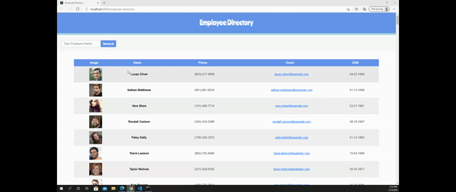

# **The Employee Directory**

## **Greetings!**
### **_This is a React app utilizing AJAX/API._** 
---
## **Description:**
#### **_With the use of the "Random User API": <https://randomuser.me/>, This program allows user to search for the employees' information by searching employees' name."_**
---
## **Example Gif:**

## **Link to the video: <https://drive.google.com/file/d/1LkGJZT0AzkeoP5oUkL7DO2YthfvDifDS/view>**

---
## **Guidline:**
### 1. Start: 
#### -Follow the link: <https://ahnlok.github.io/employee-directory/>
### 2. Main Page:
#### -Main page will who the 200 randomly generated employee information from Random User API.
### 3. Search:
#### -The user can search for the employee information by start typing by employee name.
#### (Each letter will filter the names of employee as the user types through).
### 4. Search Result:
#### -Similar to the start of the webpage, the user will be able to see the filtered employee information according to the search input by name.

## **Installation**
### **_git clone: <git@github.com:ahnlok/employee-directory.git>_**

---
---
## **GitHub**
### **_GitHub_**: **<https://github.com/ahnlok/employee-directory>**
### **_Deployed Github Site_**: **<https://ahnlok.github.io/employee-directory/>**

---

## **Contact**
### **_E-Mail_**: **<ansungpil1@gmail.com>**
### **_LinkedIn_**: **<https://www.linkedin.com/in/an-sungpil-95ab8490/>**
### **_GitHub_**: **<https://github.com/ahnlok>**

---
## **License**
### **© Sungpil An 2021**

#### _Licensed under the MIT License_